Sou funcionário da **DevLOG** — *O T.I. para a sua transportadora*, onde cuido de suporte, integrações e automação para operadores logísticos, lidando no dia a dia com TMS e documentos fiscais (CT-e, MDF-e, NF-e). Também desenvolvo sites pela **DevEassis** e estudo na **USCS**. Nas horas vagas faço produção técnica de podcasts, mexo com Linux e crio bots de Discord.

### Conecte-se comigo!

### Minha Stack

  
  
  
  
  
  
  
  
  
  

 

### GitHub Stats

  
  

<picture>
  <source media="(prefers-color-scheme: dark)" srcset="https://raw.githubusercontent.com/GabrielTorres2/GabrielTorres2/output/github-snake-dark.svg" />
  <source media="(prefers-color-scheme: light)" srcset="https://raw.githubusercontent.com/GabrielTorres2/GabrielTorres2/output/github-snake.svg" />
  
</picture>

Arte do Killua por Ero Kagy
